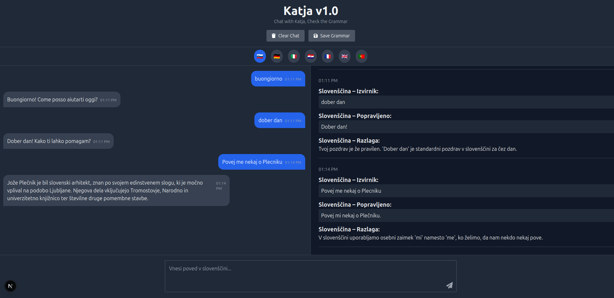
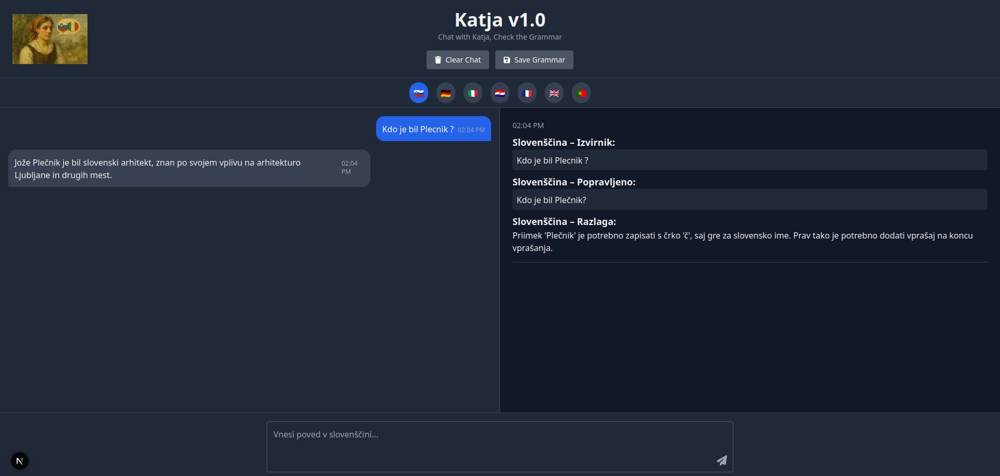
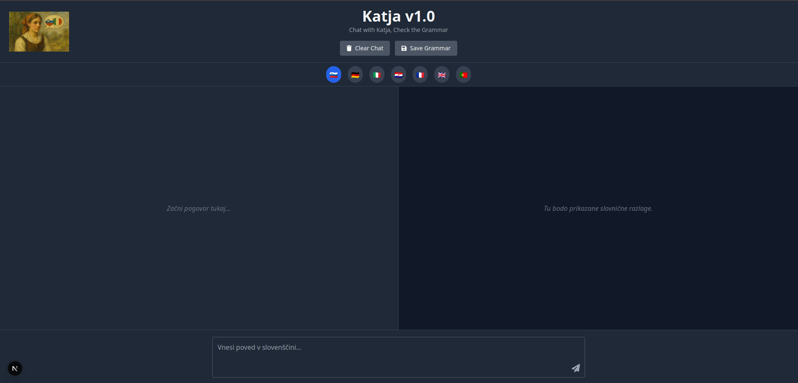

[](https://opensource.org/licenses/Apache-2.0)

# Katja — A Local-First Grammar Assistant for Slovene, Italian, and More

**Katja** is a full-stack, local-first grammar chat assistant built for intentional language learners. Designed to provide instant grammar corrections and explanations, Katja supports a growing set of European languages and runs entirely on your machine using FastAPI and Next.js.

---

## Philosophy

Katja is not a SaaS platform. It is a **grammar-aware conversation environment** that helps users think, write, and reflect in natural language — without relying on centralized infrastructure.

Its guiding principles are:

* **Privacy**: All interactions happen locally. No user data is logged or sent to third-party services.
* **Precision**: Grammar feedback is direct, clear, and linguistically grounded.
* **Minimalism**: Lightweight frontend and backend with LLM support via API key.
* **Multilingual**: Designed for European language learners — not just English.

---

## Supported Languages

Katja currently supports grammar feedback and conversation in:

* 🇸🇮 Slovene
* 🇩🇪 German
* 🇮🇹 Italian
* 🇭🇷 Croatian
* 🇫🇷 French
* 🇬🇧 English
* 🇵🇹 Portuguese

Language switching is available via UI buttons in the chat interface.

---

## Repository Structure

```
katja/
├── backend/         # FastAPI backend with CrewAI flow
│   ├── teacher_flow.py
│   └── ...
├── frontend/        # Next.js frontend
│   ├── components/
│   ├── pages/
│   └── public/      # UI icons, screenshots, favicon
├── launch.sh        # Launcher script for full stack
├── .gitignore
├── README.md
└── LICENSE
```

---

## Getting Started

### 1. Clone and launch (Linux)

```bash
git clone https://github.com/SL-MAR/katja.git
cd katja
chmod +x launch.sh
./launch.sh
```

This script launches:

* Frontend ([http://localhost:3000](http://localhost:3000))
* Backend ([http://localhost:8000/docs](http://localhost:8000/docs))
* Opens both in browser automatically

> See `launch.sh` for the full launcher logic.

### 2. Manual startup (optional)

Backend:

```bash
cd backend
python3 -m venv venv
source venv/bin/activate
pip install -r requirements.txt
uvicorn main:app --reload
```

Frontend:

```bash
cd frontend
npm install
npm run dev
```

---

## Screenshots

| Chat Interface                   | Grammar Feedback                         | Landing Page                                |
| -------------------------------- | ---------------------------------------- | ------------------------------------------- |
|  |  |  |

---

## Launcher Script (`launch.sh`)

```bash
#!/usr/bin/env bash
# launch.sh – Start Katja Full Stack (Frontend + Backend)

BASE="$HOME/projects"
ROOT="$BASE/katja"
FRONTEND_DIR="$ROOT/frontend"
BACKEND_DIR="$ROOT/backend"
VENV_DIR="$BACKEND_DIR/venv"

# Launch Frontend
gnome-terminal \
  --title="Katja Frontend" \
  -- bash -ic "\
    cd \"$FRONTEND_DIR\" && \
    npm install && \
    npm run dev || (echo '❌ Frontend crashed. Press Enter to exit.'; read)"

# Launch Backend
gnome-terminal \
  --title="Katja Backend" \
  -- bash -ic "\
    cd \"$BACKEND_DIR\" && \
    source \"$VENV_DIR/bin/activate\" && \
    pip install -r requirements.txt && \
    uvicorn main:app --reload || (echo '❌ Backend crashed. Press Enter to exit.'; read)"

# Open in browser
( sleep 2 && xdg-open http://localhost:3000 ) &
( sleep 2 && xdg-open http://localhost:8000/docs ) &
```

---

## Planned Modules

* 🧠 Chat memory across sessions
* 💾 Save grammar feedback per message
* 🎤 Voice transcription (ElevenLabs Scribe)
* 💳 Payment support (PayPal)

---

## System Architecture

| Component          | Status     | Access Model            |
| ------------------ | ---------- | ----------------------- |
| Grammar backend    | ✅ Open     | FastAPI, local-only     |
| Frontend UI        | ✅ Open     | Next.js, static assets  |
| Language selector  | ✅ Open     | Frontend toggle         |
| Local storage      | 🔒 Planned | Grammar feedback saving |
| Speech integration | 🔒 Planned | ElevenLabs (optional)   |

---

## Licensing

This repository is distributed under the **Apache License 2.0**. You are free to use, modify, and redistribute the code, provided attribution and license terms are respected. See [`LICENSE`](./LICENSE) for full terms.

---

## Citation

If this project contributes to your learning, publication, or app, you may cite it as:

```
S.M.Laignel. (2025). Katja: A Local-First Grammar Assistant for European Languages. GitHub Repository. https://github.com/SL-MAR/katja
```
